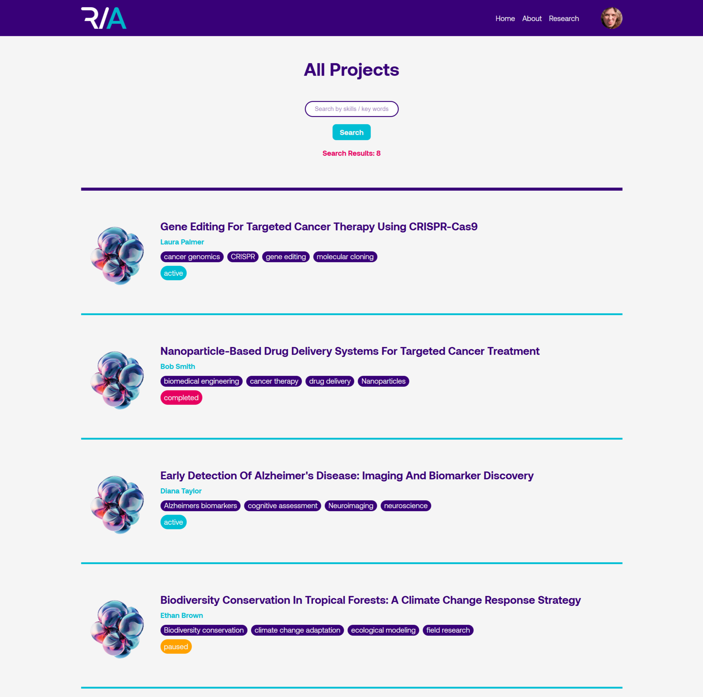

# 🧪 Research Agora

Research Agora, a social platform built to foster collaboration and innovation among researchers, helping them connect, create projects, and drive progress together.

## 📸 Screenshots





# 🚀 Project Setup Guide

## ✅ Prerequisites

Before setting up the project, ensure you have the following installed:

### 🖥️ **0. Install editor such as Visual Studio**

- Download and install Visual Studio set up [Visual Code on Linux](https://code.visualstudio.com/docs/setup/linux)
- Install additional components [](https://code.visualstudio.com/docs/setup/additional-components)such as [Git](https://git-scm.com/downloads) and [extensions](https://code.visualstudio.com/docs/editor/extension-marketplace)

### 📦 1. Install Node.js and npm

- Download and install Node.js from [Node.js Official Website](https://nodejs.org/)
- Verify installation:
    
    ```
    node -v
    npm -v
    
    ```
    

### 🛢️ 2. Install MySQL Workbench

- Download and install MySQL from [MySQL Official Website](https://dev.mysql.com/downloads/)
- Install MySQL Workbench for database management
- Start MySQL Server and create a new database from the script database.sql

## ⚙️ Project Installation

### 🔽 1. Clone the Repository

```
git clone https://github.com/reposocratech/Agora.git
cd Agora

```

### 🔧 2. Install Backend Dependencies

Navigate to the backend folder and install dependencies:

```
cd server
npm install

```

### 🗄️ 3. Configure the Database

- Create a `.env` file in the `backend` directory and add the following environment variables:
    
    ```
    PORT = 4000
    DB_HOST=localhost
    DB_USER=root
    DB_PASSWORD=yourpassword
    DB_NAME=research_agora
    DB_PORT=3306
    
    ```
    

### 🚀 4. Start the Backend Server

```
npm run dev

```

### 🎨 5. Install Frontend Dependencies

Navigate to the frontend folder and install dependencies:

```
cd ../Cliente
npm install

```

### 🛠️ 6. Configure the Frontend

- Create a `.env` file in the Cliente directory and add the following:
    
    ```
    REACT_APP_API_URL=http://localhost:5173/api
    
    ```
    

### ⚡ 7. Start the Frontend Server

```
npm run dev

```

## 🌐 Running the Application

Now, the backend should be running on `http://localhost:4000` and the frontend on `http://localhost:5173`. Open your browser and navigate to `http://localhost:5173` to start using the application!